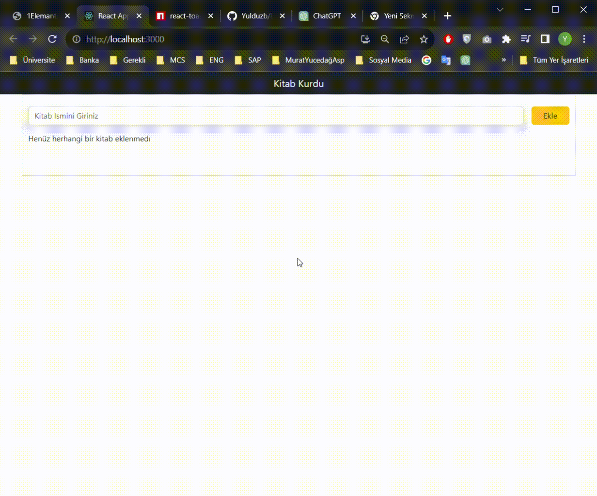

<h1>Library-Manager-Project</h1>

This project allows the user to create a personal library and be able to organize, bookmark and delete these books. This is a simple web application built using React.

<h3>Features</h3>
This app includes the following features:

You can add new books.
You can organize books.
You can mark or unmark books (read/unread).
You can delete books.
<h3>Technologies</h3>
The following technologies were used in this project:

React: JavaScript library used to create web applications.
react-toastify: A component used for notifications.
HTML and CSS: Basic web development languages.

